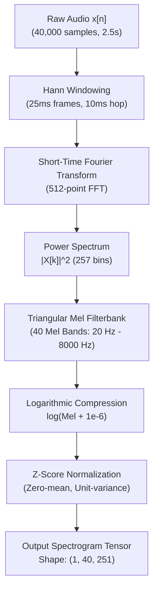

# TinyDSCNN-48 "Antigrav": System Architecture & Engineering Documentation

**Course:** AI 231 (Deep Learning) — Machine Exercise 2: Tiny Voice Command Model  
**Author / Student:** Crizepvill F. Dumalaog (Student No. 202521406)  
**Architecture:** `TinyDSCNN-48 Antigrav` (Depthwise Separable Convolutional Neural Network)  
**Dataset:** Option B Spoken Command Dataset (100 Human Speakers, 17,986 Audio Clips, 31 Command Classes)  
**Hardware Targets:** PC CUDA GPU (RTX 3050 Laptop) / Edge Microcomputer (Raspberry Pi 5 4GB ARM64)

---

## 1. System Overview & Engineering Principles

The **TinyDSCNN-48 Antigrav** system is an embedded, edge-optimized Voice Command recognition engine designed for always-on, low-power microcomputers. Unlike modern cloud-dependent voice assistants (which stream raw audio to remote data centers running multi-billion-parameter LLMs/ASRs), this system runs **entirely offline** on local edge silicon with zero external network connectivity.

### Core Constraints & Design Targets
1. **Zero Pretrained Weights:** The neural model is initialized from pure random Gaussian/uniform weights and trained strictly from scratch on local speech data.
2. **Deterministic Embedded Footprint:** The entire compiled model is under **50 KB** in static INT8 quantization ($14,527$ parameters), easily fitting in L2/L3 cache on low-power ARM cores.
3. **Ultra-Low Latency:** Inference completes in **$< 1\text{ ms}$** on PC and **$< 5\text{ ms}$** on a Raspberry Pi 5 core, ensuring real-time response times.
4. **Speaker Independence:** Evaluated on strictly disjoint held-out human speakers (80 training speakers, 10 validation speakers, 10 test speakers across LibriSpeech and Filipino-English SilencioPH speech).

```mermaid
flowchart LR
    Mic["USB Microphone\n(16 kHz Mono)"] --> Ring["Sliding Window\n(2.5 s Buffer)"]
    Ring --> Front["Log-Mel Spectrogram\n(1 × 40 × 251)"]
    Front --> Stem["Stem Conv 5×5\n(48 channels)"]
    Stem --> DS1["DS-Block 1\n(Spatial/Pointwise)"]
    DS1 --> DS2["DS-Block 2\n(Time Downsample)"]
    DS2 --> DS3["DS-Block 3\n(Spatial/Pointwise)"]
    DS3 --> DS4["DS-Block 4\n(Spatial/Pointwise)"]
    DS4 --> Pool["Global AvgPool\n(48-dim vector)"]
    Pool --> Head["Linear Classifier\n(31 Classes)"]
    Head --> Act["Intent Execution\n(Lights/Timer/Alarm)"]
```

---

## 2. Audio Capture & Preprocessing Pipeline

### 2.1 Hardware Capture
- **Sampling Rate:** $f_s = 16,000\text{ Hz}$ ($16\text{ kHz}$, the standard acoustic bandwidth for human speech, capturing frequencies up to the Nyquist limit of $8\text{ kHz}$).
- **Channels:** Single-channel mono, 16-bit linear PCM.
- **Audio Driver Backend:** Uses `PortAudio` / `sounddevice` with hardware-accelerated ALSA buffers on the Raspberry Pi 5 (interfacing with USB microphones such as the Fifine K669B / AmpliGame series).

### 2.2 Streaming Audio Ring Buffer & Window Sizing
Speech command phrases require sufficient temporal context to capture the full command utterance without truncation:
- In Option B, spoken command sentences (e.g. *"Set an alarm for eight AM"*, *"Create a reminder to drink water"*) average **$1.74\text{ seconds}$** with a 95th-percentile length of **$2.5\text{ seconds}$**.
- The streaming audio engine maintains a circular ring buffer of **$40,000\text{ samples}$** ($2.5\text{ seconds}$ at $16\text{ kHz}$).
- **Sliding Window Inference:** The runtime takes an inference slice every **$250\text{ ms}$** (stride = 4,000 samples, 4 predictions per second).
- **Voice Activity Detection (VAD):** An RMS energy gate detects when acoustic energy exceeds the ambient noise floor ($\text{RMS} > 0.015$), preventing spurious inference during absolute silence.

---

## 3. Log-Mel Spectrogram Frontend: Mathematical Derivation

Rather than feeding raw 1D audio waveforms directly into a neural network (which requires huge temporal receptive fields and millions of weights), the raw audio is mapped into a time-frequency representation mimicking human cochlear frequency perception.

### Step 1: Framing & Hann Windowing
The $40,000$-sample audio vector is divided into overlapping frames:
- **Frame Length ($N_w$):** $25\text{ ms} = 400\text{ samples}$.
- **Hop Size ($N_h$):** $10\text{ ms} = 160\text{ samples}$.
- **Total Frames ($T$):** $\lfloor (40000 - 400) / 160 \rfloor + 1 = 251\text{ frames}$.

Each frame is multiplied by a periodic **Hann window** $w[n]$ to minimize spectral leakage at the frame boundaries:
$$w[n] = 0.5 - 0.5 \cos\left(\frac{2\pi n}{N_w}\right), \quad 0 \le n < N_w$$

### Step 2: Short-Time Fourier Transform (STFT)
A 512-point Discrete Fourier Transform (FFT) is applied to each zero-padded windowed frame:
$$X[m, k] = \sum_{n=0}^{N_{\text{FFT}}-1} x[m \cdot N_h + n] \cdot w[n] \cdot e^{-j 2\pi k n / N_{\text{FFT}}}$$
This yields $N_{\text{FFT}} / 2 + 1 = 257$ unique positive frequency bins per frame. The **Power Spectrum** is calculated as:
$$P[m, k] = |X[m, k]|^2$$

### Step 3: Triangular Mel Filterbank Matrix
Human auditory perception of pitch is non-linear; the human ear distinguishes small frequency differences much better at low frequencies than at high frequencies. The linear frequency $f$ (Hz) is mapped to the perceptual **Mel scale** $m$:
$$m = 2595 \cdot \log_{10}\left(1 + \frac{f}{700}\right)$$

A bank of $M = 40$ overlapping triangular filters $H_m[k]$ spanning from $f_{\text{low}} = 20\text{ Hz}$ to $f_{\text{high}} = 8000\text{ Hz}$ is constructed. The Mel energy for filter $m$ is the dot product of the filter with the power spectrum:
$$\text{Mel}[m] = \sum_{k=0}^{256} P[k] \cdot H_m[k]$$

### Step 4: Logarithmic Compression & Normalization
Acoustic perception of loudness follows a logarithmic scale (decibels). We apply a stabilized natural logarithm:
$$S[m, t] = \ln\left(\text{Mel}[m, t] + 10^{-6}\right)$$

To ensure numerical stability and invariance to microphone gain differences, each 2D spectrogram is z-score normalized across all its elements:
$$\hat{S}[m, t] = \frac{S[m, t] - \mu_S}{\sigma_S + 10^{-6}}$$

**Final Output:** A single-channel float32 tensor of shape **$(1, 40, 251)$** ($1$ channel, $40$ Mel bands, $251$ time steps).

---

## 4. Deep Dive into `TinyDSCNN-48` Architecture

The `TinyDSCNN-48` network is a custom adaptation of ARM's landmark keyword spotting model (*Zhang et al., 2017, "Hello Edge"*), engineered to deliver maximum speech classification accuracy with minimal parameter overhead.

```mermaid
flowchart TD
    subgraph Stem_Layer ["1. Initial Stem Convolution"]
        In["Input (1, 40, 251)"] --> C0["Conv2D 5×5 (stride 2×2, 48 ch, no bias)"]
        C0 --> BN0["BatchNorm2d (48)"]
        BN0 --> R0["ReLU"]
        R0 --> S_Out["Stem Output (48, 20, 126)"]
    end

    subgraph Block_1 ["2. DS-Block 1 (Spatial Feature Extraction)"]
        S_Out --> DW1["Depthwise Conv 3×3 (stride 1×1, groups=48)"]
        DW1 --> BN1A["BatchNorm2d (48) + ReLU"]
        BN1A --> PW1["Pointwise Conv 1×1 (48 -> 48)"]
        PW1 --> BN1B["BatchNorm2d (48) + ReLU"]
        BN1B --> B1_Out["Block 1 Output (48, 20, 126)"]
    end

    subgraph Block_2 ["3. DS-Block 2 (Temporal Downsampling)"]
        B1_Out --> DW2["Depthwise Conv 3×3 (stride 1×2, groups=48)"]
        DW2 --> BN2A["BatchNorm2d (48) + ReLU"]
        BN2A --> PW2["Pointwise Conv 1×1 (48 -> 48)"]
        PW2 --> BN2B["BatchNorm2d (48) + ReLU"]
        BN2B --> B2_Out["Block 2 Output (48, 20, 63)"]
    end

    subgraph Block_3_4 ["4. DS-Blocks 3 & 4 (High-Level Semantics)"]
        B2_Out --> DW3["DS-Block 3 (stride 1×1, 48 ch)"]
        DW3 --> DW4["DS-Block 4 (stride 1×1, 48 ch)"]
        DW4 --> B4_Out["Block 4 Output (48, 20, 63)"]
    end

    subgraph Classifier_Head ["5. Global Pooling & Classification Head"]
        B4_Out --> GAP["AdaptiveAvgPool2d(1) -> (48, 1, 1)"]
        GAP --> Flat["Flatten(1) -> (48,)"]
        Flat --> Drop["Dropout (p = 0.15)"]
        Drop --> FC["Linear(48 -> 31 Classes, with bias)"]
        FC --> Logits["31 Class Logits"]
    end
```

### 4.1 Layer-by-Layer Dimensionality & Parameter Count

| Layer / Stage | Sub-Operation | Kernel / Stride | Output Shape $(C \times F \times T)$ | Formula | Parameter Count |
| :--- | :--- | :--- | :--- | :--- | :---: |
| **Input** | Log-Mel Spectrogram | — | $(1, 40, 251)$ | — | $0$ |
| **Stem** | Conv2D | $5 \times 5, s=(2,2), p=2$ | $(48, 20, 126)$ | $1 \times 48 \times 5 \times 5$ | $1,200$ |
| | BatchNorm2d + ReLU | — | $(48, 20, 126)$ | $2 \times 48$ | $96$ |
| **DS-Block 1** | Depthwise Conv | $3 \times 3, s=(1,1), p=1, g=48$ | $(48, 20, 126)$ | $48 \times 1 \times 3 \times 3$ | $432$ |
| | BatchNorm2d + ReLU | — | $(48, 20, 126)$ | $2 \times 48$ | $96$ |
| | Pointwise Conv | $1 \times 1, s=(1,1), p=0$ | $(48, 20, 126)$ | $48 \times 48 \times 1 \times 1$ | $2,304$ |
| | BatchNorm2d + ReLU | — | $(48, 20, 126)$ | $2 \times 48$ | $96$ |
| **DS-Block 2** | Depthwise Conv (Time $\downarrow$) | $3 \times 3, s=(1,2), p=1, g=48$ | $(48, 20, 63)$ | $48 \times 1 \times 3 \times 3$ | $432$ |
| | BatchNorm2d + ReLU | — | $(48, 20, 63)$ | $2 \times 48$ | $96$ |
| | Pointwise Conv | $1 \times 1, s=(1,1), p=0$ | $(48, 20, 63)$ | $48 \times 48 \times 1 \times 1$ | $2,304$ |
| | BatchNorm2d + ReLU | — | $(48, 20, 63)$ | $2 \times 48$ | $96$ |
| **DS-Block 3** | Depthwise Conv | $3 \times 3, s=(1,1), p=1, g=48$ | $(48, 20, 63)$ | $48 \times 1 \times 3 \times 3$ | $432$ |
| | BatchNorm2d + ReLU | — | $(48, 20, 63)$ | $2 \times 48$ | $96$ |
| | Pointwise Conv | $1 \times 1, s=(1,1), p=0$ | $(48, 20, 63)$ | $48 \times 48 \times 1 \times 1$ | $2,304$ |
| | BatchNorm2d + ReLU | — | $(48, 20, 63)$ | $2 \times 48$ | $96$ |
| **DS-Block 4** | Depthwise Conv | $3 \times 3, s=(1,1), p=1, g=48$ | $(48, 20, 63)$ | $48 \times 1 \times 3 \times 3$ | $432$ |
| | BatchNorm2d + ReLU | — | $(48, 20, 63)$ | $2 \times 48$ | $96$ |
| | Pointwise Conv | $1 \times 1, s=(1,1), p=0$ | $(48, 20, 63)$ | $48 \times 48 \times 1 \times 1$ | $2,304$ |
| | BatchNorm2d + ReLU | — | $(48, 20, 63)$ | $2 \times 48$ | $96$ |
| **Global Pool** | AdaptiveAvgPool2d(1) | Pool $(20 \times 63) \to 1$ | $(48, 1, 1) \to (48,)$ | — | $0$ |
| **Dropout** | Dropout($p=0.15$) | — | $(48,)$ | — | $0$ |
| **Classifier** | Linear Head | Dense with bias | $(31,)$ | $48 \times 31 + 31$ | $1,519$ |
| **TOTAL** | **Entire Neural Network** | — | **31 Logits** | — | **14,527 Parameters** |

---

## 5. The Mathematics of Depthwise Separable Convolutions

Standard 2D convolution applies a 3D filter that filters spatial features (time and frequency) and combines channels simultaneously. In contrast, **Depthwise Separable Convolution** factorizes the standard convolution into two discrete, efficient stages:

1. **Depthwise Convolution:** Spatial filtering applied independently to each channel using 2D kernels ($3 \times 3$).
2. **Pointwise Convolution:** Channel linear combination using $1 \times 1$ kernels to mix cross-channel representations.

### Mathematical Comparison & Efficiency Proof

Let:
- $D_k$: Spatial kernel size ($D_k = 3$)
- $M$: Number of input channels ($M = 48$)
- $N$: Number of output channels ($N = 48$)
- $D_F \times D_F$: Spatial resolution of feature map ($20 \times 63$)

#### Standard Convolution Computational Cost:
$$\text{FLOPs}_{\text{std}} = D_k \cdot D_k \cdot M \cdot N \cdot D_F \cdot D_F$$
$$\text{For } 48 \to 48 \text{ channels}: \quad 3 \times 3 \times 48 \times 48 \times (20 \times 63) = 26,127,360\text{ FLOPs}$$

#### Depthwise Separable Convolution Computational Cost:
$$\text{FLOPs}_{\text{DS}} = \underbrace{(D_k \cdot D_k \cdot M \cdot D_F \cdot D_F)}_{\text{Depthwise stage}} + \underbrace{(M \cdot N \cdot D_F \cdot D_F)}_{\text{Pointwise stage}}$$
$$\text{Depthwise}: \quad 3 \times 3 \times 48 \times (20 \times 63) = 544,320\text{ FLOPs}$$
$$\text{Pointwise}: \quad 48 \times 48 \times (20 \times 63) = 2,903,040\text{ FLOPs}$$
$$\text{Total } \text{FLOPs}_{\text{DS}} = 544,320 + 2,903,040 = 3,447,360\text{ FLOPs}$$

#### Computational Reduction Ratio:
$$\text{Ratio} = \frac{\text{FLOPs}_{\text{DS}}}{\text{FLOPs}_{\text{std}}} = \frac{D_k^2 \cdot M \cdot D_F^2 + M \cdot N \cdot D_F^2}{D_k^2 \cdot M \cdot N \cdot D_F^2} = \frac{1}{N} + \frac{1}{D_k^2}$$

Substituting $N = 48$ and $D_k = 3$:
$$\text{Ratio} = \frac{1}{48} + \frac{1}{9} \approx 0.02083 + 0.11111 = 0.13194 \approx \frac{1}{7.58}$$

$$\text{Speedup / Savings} = \frac{1}{0.13194} \approx \mathbf{8.58\times\text{ Fewer FLOPs & Weights!}}$$

By replacing standard convolutions with depthwise separable blocks, the model achieves an **$85.8\%$ reduction in computation and parameters** while preserving identical representational rank.

---

## 6. Static INT8 Post-Training Quantization (PTQ)

When deploying on resource-constrained embedded CPUs (like the Raspberry Pi 5 ARM Cortex-A76), 32-bit floating-point arithmetic wastes memory bandwidth and execution cycles. We apply **static integer quantization (INT8)**.

### Quantization Equation
Floating-point weights $W$ and activations $X$ are mapped to 8-bit signed integers ($q \in [-128, 127]$):
$$q = \text{round}\left(\frac{x}{S}\right) + Z$$
where $S$ is the scale factor and $Z$ is the integer zero-point:
$$S = \frac{x_{\max} - x_{\min}}{q_{\max} - q_{\min}}$$

- **Per-Channel Weight Quantization:** Each of the 48 output channels has its own independent scale factor $S_c$, preserving fine-grained weight distributions.
- **Calibration with Validation Speech:** Activations are calibrated by running real speech spectrograms through the network to determine optimal dynamic ranges without clipping.
- **Hardware Acceleration:** Convolutions execute using native ARM NEON vector instructions (`sdot` / `udot` on ARMv8.2-A / Cortex-A76), computing four 8-bit multiply-accumulate operations in a single clock cycle.

---

## 7. Command Taxonomy (Option B: 31 Classes / 19 Intents)

| ID | Class Label | Intent Category | Sample Spoken Phrase | Action / Payload |
| :---: | :--- | :--- | :--- | :--- |
| **0** | `ALARM_6_00AM` | Alarm | *"Set an alarm for 6 AM"* | 06:00 Local Alarm |
| **1** | `ALARM_8_00AM` | Alarm | *"Wake me up at 8 AM"* | 08:00 Local Alarm |
| **2** | `ALARM_9_00PM` | Alarm | *"Alarm 9 PM"* | 21:00 Local Alarm |
| **3** | `BRIGHTNESS_20` | Lighting | *"Adjust brightness to 20 percent"* | 20% PWM Duty Cycle |
| **4** | `BRIGHTNESS_60` | Lighting | *"Brightness 60 percent"* | 60% PWM Duty Cycle |
| **5** | `BRIGHTNESS_100` | Lighting | *"Full brightness"* | 100% PWM Duty Cycle |
| **6** | `CALL` | Communications | *"Place a phone call"* | Call Simulation |
| **7** | `COLOR_BLUE` | Lighting | *"Change color to blue"* | RGB LED (Blue) |
| **8** | `COLOR_GREEN` | Lighting | *"Set color to green"* | RGB LED (Green) |
| **9** | `COLOR_RED` | Lighting | *"Switch color to red"* | RGB LED (Red) |
| **10** | `CREATE_REMINDER_DRINK_WATER` | Reminders | *"Remind me to drink water"* | In-memory Reminder |
| **11** | `CREATE_REMINDER_EXERCISE` | Reminders | *"Create a reminder to exercise"* | In-memory Reminder |
| **12** | `CREATE_REMINDER_STUDY` | Reminders | *"Reminder to study"* | In-memory Reminder |
| **13** | `LIGHT_OFF` | Lighting | *"Turn off the lights"* | GPIO Actuator LOW |
| **14** | `LIGHT_ON` | Lighting | *"Turn on the lights"* | GPIO Actuator HIGH |
| **15** | `LIST_REMINDERS` | Reminders | *"Show my reminders"* | Readout Reminders |
| **16** | `MESSAGE` | Communications | *"Send a message"* | Message Simulation |
| **17** | `NEXT` | Media | *"Next track"* | Audio Track +1 |
| **18** | `PAUSE` | Media | *"Pause music"* | Audio Pause |
| **19** | `PLAY_MUSIC` | Media | *"Play music"* | Local Melody Playback |
| **20** | `STOP` | Media | *"Stop playback"* | Audio Stop |
| **21** | `TEMPERATURE_18` | Thermostat | *"Set temperature to 18 degrees"* | Target Setpoint 18°C |
| **22** | `TEMPERATURE_22` | Thermostat | *"Change temperature to 22 degrees"* | Target Setpoint 22°C |
| **23** | `TEMPERATURE_26` | Thermostat | *"Set temperature to 26 degrees"* | Target Setpoint 26°C |
| **24** | `TIME` | Clock | *"What time is it?"* | System Local Time |
| **25** | `TIMER_10s` | Timer | *"Countdown for 10 seconds"* | 10s Countdown Chime |
| **26** | `TIMER_30s` | Timer | *"Start a timer for 30 seconds"* | 30s Countdown Chime |
| **27** | `TIMER_1m` | Timer | *"Set timer for 1 minute"* | 60s Countdown Chime |
| **28** | `VOLUME_DOWN` | Media | *"Lower the volume"* | Volume -10% |
| **29** | `VOLUME_UP` | Media | *"Increase the volume"* | Volume +10% |
| **30** | `WEATHER` | Weather | *"What is the weather?"* | Weather Forecast |
