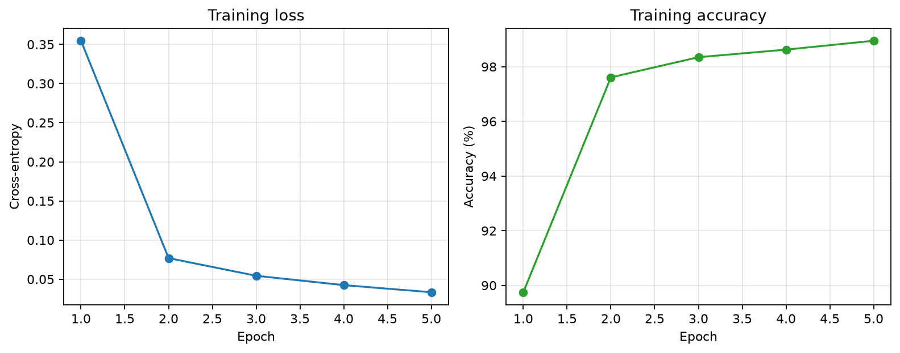
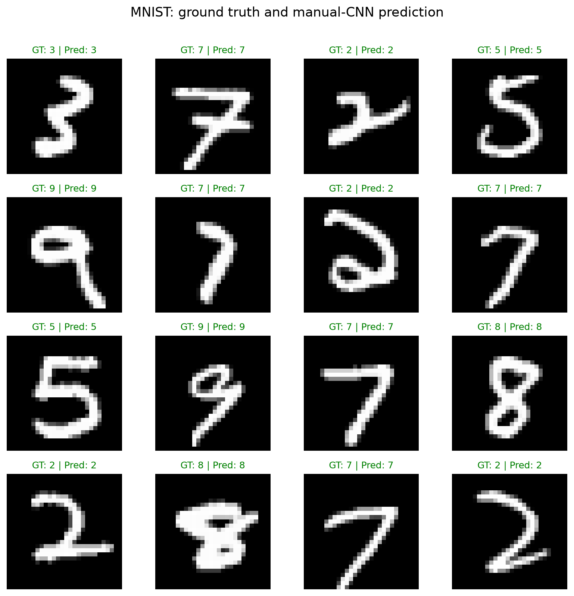

# ME1 — Three-layer MNIST CNN using Einops and Einsum

Student: **Crizepvill Dumalaog**

Course: **AI 231**

## Assignment

Using an agent, build a three-layer CNN for MNIST classification. Implement
the layers and operations using PyTorch tensors with Einops/`einsum`, without
using a CNN library or PyTorch CNN layers. Train for exactly five epochs,
report official MNIST test-split accuracy, and show 16 test images in a 4×4
grid with ground-truth and predicted labels in an executed Jupyter notebook.

## Compliance boundary

The ME1 implementation does **not** use:

- `torch.nn` or `torch.nn.functional`
- `Conv1d`, `Conv2d`, or `Conv3d`
- functional convolution helpers
- PyTorch pooling, flatten, linear, loss, activation, or `Unfold` layers
- Keras, TensorFlow, SciPy convolution, or pretrained/CNN model libraries
- NLP libraries or NLP operations

The implementation uses:

- `Tensor.as_strided` to expose overlapping image windows without copying
- `einops.rearrange` to flatten patches and reshape outputs
- `torch.einsum` for convolution and fully connected transformations
- `einops.reduce` for max pooling
- elementary PyTorch tensor operations for padding, ReLU, normalization, and
  a manually written log-sum-exp cross-entropy objective
- `torch.optim.Adam` only for parameter updates
- `torchvision.datasets.MNIST` only to download/read the official MNIST data;
  no torchvision model, transform, or neural-network operation is used

## Architecture

```text
Input: 1 × 28 × 28
  → manual convolution 1: 1 → 8 channels, 5×5, padding 2
  → manual ReLU
  → Einops 2×2 max reduction
  → manual convolution 2: 8 → 16 channels, 3×3, padding 1
  → manual ReLU
  → Einops 2×2 max reduction
  → manual convolution 3: 16 → 32 channels, 3×3, padding 1
  → manual ReLU
  → Einops flatten
  → einsum dense layer: 32×7×7 → 64
  → manual ReLU
  → einsum classifier: 64 → 10
```

“Three-layer CNN” is interpreted as **three convolutional stages**. The two
dense transformations form the classifier head and are also implemented
manually with `einsum`.

## Deliverables

- `ME1_MNIST_Manual_CNN.ipynb` — executed submission notebook containing the
  explanation, implementation, five epoch logs, final test accuracy, and 4×4
  prediction grid
- `src/manual_cnn.py` — manual tensor/Einops/einsum layers and model
- `src/experiment.py` — MNIST loading, training, evaluation, and report plots
- `train.py` — reproducible command-line runner
- `tests/` — numerical, gradient, architecture, and prohibited-API checks
- `artifacts/metrics.json` — machine-readable verified run result
- `artifacts/training_curves.png` — five-epoch training history
- `artifacts/predictions_4x4.png` — 16 test samples with GT and prediction

## Run

Activate the shared environment, then:

```powershell
Set-Location 'C:\Users\danda\Desktop\MEng AI Notebooks\AI 222 231\AI 231\ME1_CNN_Einops'
python train.py --epochs 5 --device auto
```

Rebuild the notebook structure:

```powershell
python tools\build_notebook.py
```

Execute it from a clean kernel:

```powershell
jupyter nbconvert --to notebook --execute ME1_MNIST_Manual_CNN.ipynb `
  --output ME1_MNIST_Manual_CNN.ipynb `
  --ExecutePreprocessor.timeout=1800
```

Run the automated checks:

```powershell
python -m pytest -q
```

## Verified result

The executed clean-kernel run on 2026-08-29 produced:

- Official MNIST training samples: **60,000**
- Official MNIST test samples: **10,000**
- Epochs: **5**
- Device: **CUDA — NVIDIA GeForce RTX 3050 Laptop GPU**
- Trainable parameters: **107,082**
- Deterministic PyTorch algorithms: **enabled**
- Final training loss: **0.0333**
- Final training accuracy: **98.95%**
- Test loss: **0.0464**
- **Test accuracy: 98.50%**

| Epoch | Training loss | Training accuracy |
|---:|---:|---:|
| 1 | 0.3546 | 89.75% |
| 2 | 0.0769 | 97.61% |
| 3 | 0.0544 | 98.35% |
| 4 | 0.0424 | 98.63% |
| 5 | 0.0333 | 98.95% |

The authoritative full-precision values and deterministic sample indices are
in `artifacts/metrics.json`. The executed notebook contains all nine code-cell
outputs with no execution errors and embeds both report figures.

Two independent clean-kernel executions were compared before commit. Test
loss, test accuracy, every epoch's loss/accuracy, and the 16 selected indices
matched exactly; elapsed seconds were intentionally excluded from that
comparison.





## Understanding checklist

Before submission, the student should be able to explain:

1. How the six-dimensional strided window view represents convolution patches.
2. Why kernel flattening plus `einsum` produces each output channel.
3. How `einops.reduce` performs non-overlapping max pooling.
4. Why gradients still flow through `as_strided`, `rearrange`, and `einsum`.
5. Why the official test split is evaluated only after the fifth epoch.
6. What green and red titles mean in the 4×4 prediction grid.
